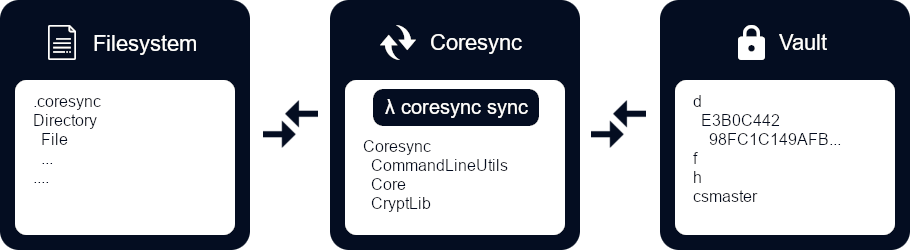

<p align="center"></p>

[](https://opensource.org/licenses/Apache-2.0)

## Introduction

CoreSync is a lightweight, multi-platform and file system based synchronization tool, which supports AES encryption with 256-bit key length. The main benefits are **total directory structure obfuscation**, controlling over command line interface (CLI) and **full logging**. Additional graphical user interface (GUI) could be build up on top of the core library. It is developed to work well together with cloud synchronization tools and task mangement systems.

## Features

### Overview

- Client-side, offline and cross-platform (**Windows, Linux, macOS**)
- Flexible, unlimited and file system based vaults
- Extendable and predefined filter system uses `RegExp`
- **No limitations** for names of file system entries
- Building up the vault is optimized for network transferring
- Clean code: Abstract, extendable, encapsulated and modular
- `.coresync` directory at the root of synchronization tree contains all necessary data
  - A custom vault path can be set with `coresync config` or on initialization

### Security

- Symmetric `Advanced Encryption Standard (AES) 256-bit` encryption
- Master passphrase protection (Client-side)
  - `DPAPI` protects sensitive master passphrase on Windows
  - On `Unix` based systems the key is stored encrypted in file system outside of the sync folder
- Randomness collected by `RandomNumberGenerator`

## Installation

### Linux

```
chmod +x coresync.sh
export PATH=$PATH:/path/to/coresync
```

### Windows (PowerShell)

```
[Environment]::SetEnvironmentVariable("PATH", "...\coresync", "User")
```

## Usage

```
Usage: coresync [options] [command]

Options:
  -?|-h|--help  Show help information

Commands:
  config  Configure synchronization directory.
  detach  Detach synchronization directory.
  filter  Add, remove or list filters. See 'filter -?' for more details.
  init    Initialize synchronization directory.
  reset   Reset synchronization directory.
  sync    Synchronize data of current or specified directory.

Use "coresync [command] --help" for more information about a command.
```

## Processing

<p align="center"></p>

### Vault

`d` contains encrypted file data.

`f` contains unique metadata of the source files. Building a checksum of file content ensures that the vault includes no redundancy.

`h` contains metadata of file system entries, which are needed to unveil the directory structure. The files are stored independently so there can't be any single point of failure. The `Rfc2898DeriveBytes` class, which implements `PBKDF2` function, generates the bytes of vault entry names. Generating a random and protected salt makes it difficult to attack the hash with the use of rainbow tables or by brute-force.

`csmaster` is a file, which is encrypted with the master passphrase and contains the sub keys of the vault entries. Changing the master passphrase will overwrite the file with no need to update the vault entries.

## Requirements

- Install the latest [.NET 8.0 Runtime](https://dotnet.microsoft.com/download/dotnet/8.0)

## License

This project is licensed under [Apache 2.0](http://www.apache.org/licenses/LICENSE-2.0).